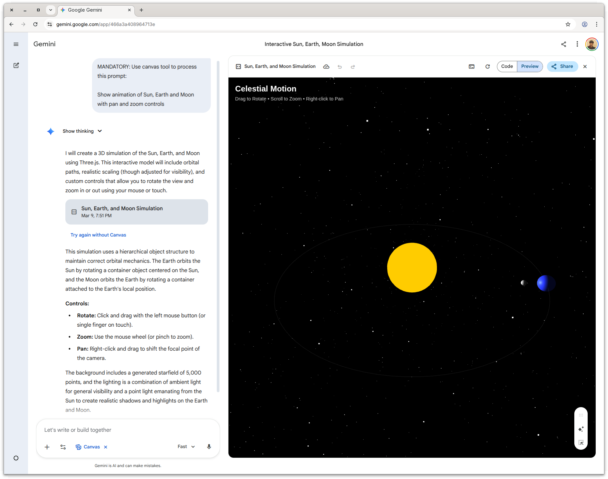
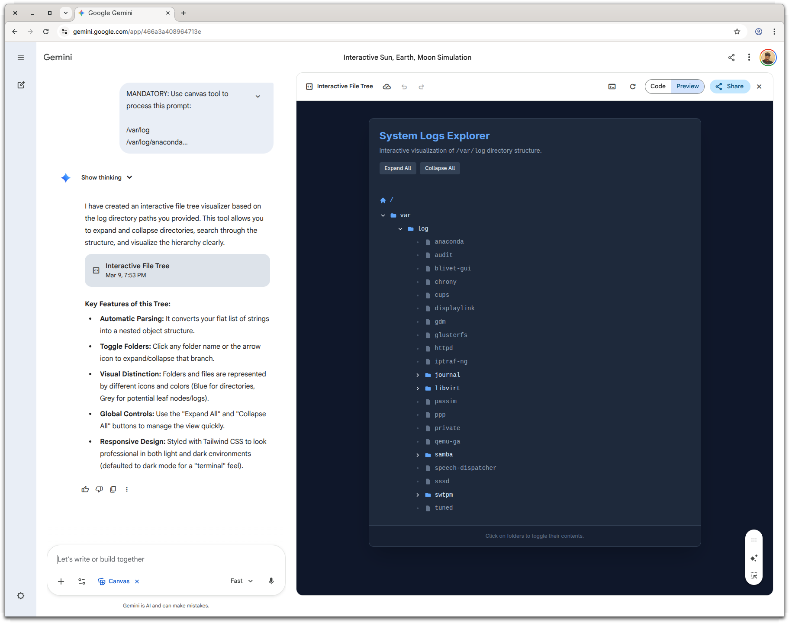

# Google Gemini Shell Companion

A browser running Google Gemini as a companion to your shell. This tool allows you to seamlessly interact with Google Gemini directly from your terminal, automatically piping standard input and command-line arguments into Gemini's web interface.

## How it Works

The script launches an instance of Google Chrome (or connects to an existing instance on a remote debugging port) and navigates to [gemini.google.com](https://gemini.google.com). It intelligently manages browser tabs based on your terminal session (using the Parent Process ID or PPID) to ensure each shell session has its own dedicated Gemini tab.

It reads any standard input (stdin) piped to it, along with any command-line arguments, and automatically types them into the Gemini chat prompt, optionally enabling the Canvas tool for processing.

## Prerequisites

- [Node.js](https://nodejs.org/) (v23.6 or higher recommended)
- Google Chrome or Chromium installed on your system

## Installation

1. Clone or download this repository.

```bash
git clone https://github.com/sandipchitale/google-gemini.git
cd google-gemini
```

2. Install the dependencies:

```bash
npm install
```

**TODO**: Build binary or npm package with CLI.

## Usage

### Shell function

Define a shell function to make it easier to use:

```bash
function gg() {
   node /path/to/google-gemini/google-gemini.ts "$@"
}
```

### Basic Prompt

Run the script and pass your prompt entirely as command-line arguments:

```bash
gg Show animation of Sun, Earth and Moon with pan and zoom controls
```



### Piping Input

You can pipe text to your:

```bash
sudo find /var/log -type d | gg Show the interactive file tree
```



Now your shell has superpowers!

## Features

- **Session Management**: Uses your terminal's PPID to maintain a 1:1 relationship between your shell session and a specific Gemini browser tab.
- **Canvas Tool Integration**: Automatically attempts to open and use the Gemini Canvas tool for enhanced processing and rendering of your prompts.
- **Background Execution**: Connects to an already-running Chrome debugging instance if available, making subsequent invocations much faster.

## Setup

The tool uses `chrome-launcher` to start Chrome with a dedicated user data directory (stored in your system's temporary directory under `google-gemini-user-data-dir`). Port `19224` is used for the remote debugging protocol.
